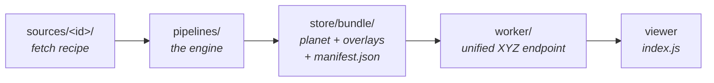

# Contributing

The goal of this project is to create a **planet-scale bathymetry product good enough to use in a nautical chart**, not just a bathymetry visualizer. It is a **derived, supplementary** layer for situational awareness and passage planning, not an official Electronic Navigational Chart and never a replacement for one.

## Principles

A chart is a safety instrument: where this layer can't be authoritative, it must be _conservative_ and _honest about its own quality_. Two rules separate "looks like a chart" from "safe to glance at on the water":

1. **Bias shallow.** Where the data is uncertain or processing must round, err toward _less_ depth — charted depth ≤ true depth. This constrains contour smoothing (a line must not migrate into deeper water) and datum choice (a low-water datum, not MSL).
2. **Carry provenance and confidence to the pixel.** The mariner must be able to tell GEBCO-interpolated deep ocean from a surveyed 3 m coastline — source identity and a quality grade travel with the data into the tiles.

## Getting Started

### Prerequisites

The toolchain is heavy native tooling. There are two routes to get it running:

1. **Docker (recommended)**: Everything runs with Docker as the only local dependency. Run any of the documented commands with `./docker.sh`.

   ```bash
   # build the harbor demo (streams sources from R2)
   ./docker.sh preview

   # serve it — open http://localhost:5173
   ./docker.sh dev
   ```

2. **Local dependencies**: This is faster for iterative development but requires a lot of local setup, could be brittle, and is subject to change. You'll need:
   - **[uv](https://docs.astral.sh/uv/)** — Python env for `pipelines/` (synced automatically on the first `uv run`).
   - **[just](https://github.com/casey/just)** — task runner.
   - **GDAL CLI** — `gdalwarp`, `gdal_translate`, `gdal_contour`, `ogr2ogr`, `gdalbuildvrt`, `ogrinfo`. Use a recent release (the container pins 3.13): 3.8-era polygon-contour mode mis-writes the deepest depth-area bucket's `amin`.
   - **tippecanoe** + **tile-join** — contour vector tiles.
   - **[actionlint](https://github.com/rhysd/actionlint)** + **shellcheck** — workflow lint (`test-workflows`).
   - **Node + npm** — the viewer, style, and Worker are one npm workspace; a single `npm install` at the root covers all three (including `wrangler`).

### Commands

The build itself is one Snakemake DAG in one entry file (the repo-root `Snakefile`; `pipelines/build.smk` is included from it). `snakemake sources` is the weekly source refresh; `snakemake bundles publish_mosaic` is the build (runs on the box via build.yml — dispatch it for a planet or bbox build). The two are one graph joined at the `cover` **checkpoint**: because the covering (the stem inventory the build scopes from) is a runtime product, the per-stem mosaic/fork/terrain jobs can't be enumerated until it lands, so cover is a checkpoint and the engine re-evaluates the DAG once it runs — a single invocation walks sources → covering → mosaic → forks → bundles. Locally, `just preview [bbox]` (or `./docker.sh preview`) runs a regional slice with sources streamed from R2 and seeds the dev Worker. What stays in the `just` file is testing, the dev servers, and one-time mask prep:

- `dev` - run both dev servers (tile Worker on :8787 + viewer on :5173, installing npm deps on first run), then open <http://localhost:5173/#12/40.55/-73.96>
- `landmask` / `watermask` - prepare the OSM land / inland-water mask once (coarse sources clamp land negatives to them)
- `test` - the whole suite: the three below
- `test-sources` - offline source-stage self-check (synthetic, no network)
- `test-engine` - engine-lane e2e (real stage-1 CLIs + the unified DAG through the `cover` checkpoint) + module self-checks
- `test-workflows` - [actionlint](https://github.com/rhysd/actionlint) (+shellcheck) over `.github/workflows/`

### Configuration

Key knobs (env vars, read by `pipelines/utils.py` / `bundle.py`):

- `BBOX` - `"W,S,E,N"` bounding box for a regional build (empty = full global)
- `MACROTILE_Z` - base/overlay split (default 8)
- `OVERLAY_SPLIT_Z` - overlay grid cell zoom (default 5 — raise it if a cell's bundle ever outgrows a CI runner)
- `NUM_OVERVIEWS` - overview pyramid levels below each source's native maxzoom
- `SMOOTH_DEM_SIGMA` / `SMOOTH_SLOPE_LOW` / `SMOOTH_SLOPE_HIGH` - slope-adaptive DEM smoothing (Gaussian sigma + the slope band it fades across)
- `SKIP_SMOOTH`, `SKIP_DEPARE` - skip that step
- `CONTOUR_NAV_SMOOTH_MAX` - navigable-band contour-smoothing gate (replaces the retired `SKIP_CONTOUR_SMOOTH`)
- `SOUND_CELL_PX` / `SOUND_MIN_DEPTH_M` - sounding spacing / min charted depth
- `DRYING_CAP` - max elevation (m) tinted as drying foreshore

## Architecture

This repo turns bathymetry DEMs (GEBCO + regional high-res sources) into MapLibre/Mapbox tiles, served through a single Cloudflare Worker endpoint. Per-source build
steps feed a planet build, which produces a base + fixed-grid overlays.



### Layout

- `sources/<id>/` - one dir per source: `metadata.json` (attribution + prep knobs), `file_list.txt` (upstream URLs). [sources/README.md](sources/README.md) is the catalog + how to add one.
- `pipelines/` - the Python engine (`uv` project) + `Justfile`. Stages: source → aggregation → mosaic → bundle.
- `worker/` - Cloudflare Worker (TypeScript) that serves the unified tile endpoint from R2.
- `index.js`, `index.html` - Vite/MapLibre viewer (repo root).
- `style/` - `@openwaters/seascape` (npm workspace): the MapLibre style as a library — flavor + `sources()`/`layers()`; the Worker serves it assembled at `/style.json`. Tests: `npm test`.
- `data/`, `pipelines/store/`, `dist/` - build artifacts (gitignored). All pipeline stages write under `pipelines/store/`.
- `docs/` - [nautical-chart references](docs/nautical-chart-references.md) (IHO/NOAA standards + sounding-selection literature); design research in [RESEARCH.md](RESEARCH.md). Planned work lives in [GitHub issues](https://github.com/openwatersio/seascape/issues).

### Stages

Four stages — `source → aggregation → mosaic → bundle` — all writing under `pipelines/store/` (gitignored), one subdir per stage (`store/source`, `store/aggregation`, `store/mosaic`, `store/pmtiles`, `store/contour`, `store/bundle`, …). Incrementality is Snakemake engine provenance: a rule's inputs and params decide freshness, so an artifact rebuilds when an input or the resolved config it read changed. Code is deliberately not an input to the heavy merge (force it with `-R mosaic_tile`), so an innocuous edit doesn't re-merge the planet.

- **source** (the Snakemake lane: repo-root `Snakefile` + `pipelines/source_*.py`): per-asset fetch → content-keyed staging (archives/formats detected from bytes) → datum → normalize to a COG → coverage polygon → a generated `catalog.json` — the source's **single registration artifact** (the machine-facing item the build reads for priority/max_zoom/land_clamp/offset, the per-file EPSG:3857 bounds under `seascape:files` that `config.source_files` is the one reader of, plus the recipe hash the build consumes; `metadata.json` stays the hand-edited input and fallback, and carries each source's prep knobs). Priority derives from `(maxzoom, id)` — GEBCO loses (smallest maxzoom), so regional sources win in overlap.
- **aggregation** (`aggregation_*.py`): `cover` slices the planet into source-aware aggregation tiles (one CSV each); `run` reprojects each source by priority into a merged Float32 DEM (Gaussian seam feather), slope-smooths it (`smooth.py`), encodes Terrarium raster tiles, and forks contours (`contour_run.py`) and soundings (`soundings_run.py`) off the same merged DEM — each fork is a separate Snakemake job, so e.g. a contour-levels change re-runs the contour fork without rewriting terrain pmtiles. Sources flagged `land_clamp` (GEBCO/EMODnet — coarse, no land/water concept) get their negative land pixels clamped to 0 against the OSM land mask (`landmask.py`, prep once with `just landmask`) right after warp, so shoreline cells don't paint false water/contours/soundings over land. A `depare_run.py` fork buckets the same merged DEM into depth-area partitions (ENC DEPARE: water between charted isobaths, `drval1`/`drval2` depth bounds) — the vector twin of the raster depth shading — and folds two more kinds into the one `depare` layer off the same `gdal_contour -p` pass and the OSM land + inland-water masks: green drying foreshore (the `[0, DRYING_CAP]` bucket seaward of the land line but kept inside mapped inland water, negative `drval1`) and unknown-depth water (`nodata`, no `drval1`).
- **mosaic** (`mosaic.py`): persists each aggregation tile's merged Float32 DEM as a durable COG plus a GTI index; stage-3 terrain renders each output zoom from it, reading the mosaic's `average` overviews rather than re-averaging encoded tiles.
- **bundle** (`bundle.py`): concat single-zoom pmtiles into `planet.pmtiles` + one overlay archive per populated grid cell + `manifest.json`; contours, soundings, and depare layers bundle into `vector.pmtiles` via tippecanoe; the per-source coverage footprints bundle standalone into `coverage.pmtiles` (the `coverage` rule). Snakemake owns bundle freshness — a bundle rebuilds when a member tile changed.

A full build (`planet`) lands in `pipelines/store/bundle/`:

- `planet.pmtiles` — the all-sources-merged base (Terrarium-encoded raster, per-zoom quantized), z0–`macrotile_z` (z8 = GEBCO native, no upsampling).
- `overlay-{z}-{x}-{y}.pmtiles` — one per populated `OVERLAY_SPLIT_Z` grid cell (default z5), z`macrotile_z+1`→cell-max, carrying the GEBCO-filled merged mosaic under that cell.
- `vector.pmtiles` — MVT vector source: `contours` (GEBCO baked to the deepest zoom by tippecanoe) plus the folded-in `soundings` and `depare` layers. `depare` (z6+) carries depth-band partitions, drying foreshore (negative `drval1`), and unknown-depth water (`nodata`) in one layer.
- `coverage.pmtiles` — source-provenance footprints, its own tileset ending at z8 (MapLibre overzooms it independently; inside `vector.pmtiles` the sea-sized fills either minted millions of deep-ocean tiles or vanished above their zoom).
- `manifest.json` — planet metadata + `overlay.cells` ({cell: max_zoom}) for the Worker.

### The published-raster contract

The Terrarium-decoded DEM (`readDepth` returns exactly this) carries depth in its negative domain and three flat category codes in its non-negative domain. For decoded value `v` (metres):

- `v < 0` — elevation below the winning source's datum; on measured water pixels `-v` is the charted depth. The *encoding* is shallow-biased (quantize never deepens a value). The *datum* is per-source: LAT/MLLW where those sources win, but GEBCO/EMODnet are ≈MSL — which sits **above** any low-water datum — so their depths read **deep** vs a proper chart datum by the local MSL−LAT separation (0.1–0.5 m micro-tidal, 2–8 m macro-tidal) until datum unification.
- `v == 0` — water present, **depth unknown** (ENC `UNSARE` analogue), not a measured depth of approximately zero.
- `v == 1` — **drying foreshore** (seabed in `(0, DRYING_CAP]` seaward of the land line): covers and uncovers with the tide. The drying *height* is not carried — the `depare` layer's `drval` bands are the only drying-height source.
- `v == 2` — **land / out of scope.** Not measured elevation; the terrain render classifies all land here (and the Worker serves it for missing tiles), so hillshade finds no slope on land — no fake topo relief, no halo ring at unknown-depth lakes.

The codes are exact multiples of the quantize floor, so they decode exactly at every zoom. Values *between* codes are smoothing/overzoom interpolation transitions — round to the nearest code, or consult `depare` for the categorical truth.

### Why a planet cap + grid overlays

GEBCO is ~z8 native; regional sources reach ~z14. Baking a full z0–14 pyramid would upsample GEBCO globally (hundreds of GB, no new data). Instead: the planet is capped at `macrotile_z` (complete, all-sources-merged base, ~1–2 GB) with fixed-grid overlay archives above it, each carrying the GEBCO-filled merged mosaic (Terrarium has no transparency, so an overlay must not punch holes). Overlays are grid cells rather than per-source archives on purpose: a cell is a fixed fraction of the globe, so a new source adds _cells_ instead of growing any single archive (a per-source overlay's size tracked its footprint and outgrew CI runner disks).

### Contours

A parallel consumer of each aggregation tile's merged DEM: `gdal_contour` at the non-uniform `CONTOUR_LEVELS` → Chaikin smooth (shapely) → clip to the unbuffered tile bbox → 4326. Seam continuity comes from **buffer the DEM input, restrict the tile output** (deterministic merge → byte-identical overlap → lines meet at the clip). Contour tiles are written per tile in `store/contour` so clean tiles persist across runs.

## Adding a source

See [sources/README.md](sources/README.md) — the source catalog (built sources, open candidates, ruled-out) and the step-by-step recipe for adding one.

## Serving (`worker/`)

The Worker presents one endpoint per layer and resolves per tile:

```
GET /seascape/{z}/{x}/{y}.webp   raster: z≤8 → planet · z>8 in a populated grid cell → that cell's overlay · else → overzoom the planet · miss → transparent
GET /seascape/{z}/{x}/{y}.pbf    vector: vector.pmtiles passthrough (contours, soundings, depare layers)
GET /seascape/coverage/{z}/{x}/{y}.pbf  coverage.pmtiles passthrough (source-provenance footprints)
GET /seascape/raster.json        TileJSON (terrarium raster)
GET /seascape/vector.json        TileJSON (vector layers)
GET /seascape/coverage.json      TileJSON (coverage footprints)
```

This keeps the base at native z8 (no global upsampling) while presenting one
source whose served maxzoom tracks the deepest overlay cell — the Worker
synthesizes the high-zoom GEBCO fallback on demand
and caches it (the overlay cell is computed from the tile address — no footprint
search). Overlays carry GEBCO-fill (Terrarium has no transparency, so a
source's nodata would otherwise punch holes over the base). All pmtiles are read
from R2 over HTTP range.

The MapLibre style is generated by `style/` (`@openwaters/seascape`, protomaps-basemaps
shape: flavor + `sources()`/`layers()`/`depthRelief()`) and served assembled by the
Worker at `/style.json` (`?unit=`/`?safety=` bake mariner defaults). Sources point at
the Worker's TileJSON, so the style needs no manifest. TypeScript: `tsc` emits
`style/dist/` on install; Vite dev reads `index.ts` directly (development export
condition), but wrangler dev and `vite build` read `dist/` — rebuild after style edits.

- Local: `npm run seed -w worker` (populates the local sim R2 from `pipelines/store/bundle/`) then `just dev`.
- Production: `npm run deploy -w worker` (set the R2 bucket + `RELEASE_PREFIX` in `wrangler.toml`).

## CI / build & release

`.github/workflows/ci.yml` (per-commit checks), `sources.yml` (source registration + mirroring), `build.yml` (full build), `gc.yml` (store garbage collection), and `release.yml` (publish + deploy):

- **Every push** (ci.yml) ensures the deps-only toolchain image exists (built only when `Dockerfile`/`pyproject.toml`/`uv.lock` change — code mounts at runtime) and runs the test suite (`just test`: offline self-checks + workflow lint) against it, plus the GC collect simulation (`test-gc`, bare bash + jq — it exercises the exact script `gc.yml` deletes with); the viewer builds too.
- **Weekly cron + manual dispatch** (sources.yml) owns everything a build reads from upstream — everything under `bathymetry/source/` plus the `bathymetry/landmask/` land + water masks. Each source is prepared (fetch → datum → normalize → polygon → tarball → catalog, per-source matrix) and pushed, short-circuited when the recipe hash in its published `catalog.json` already matches; the generated `catalog.json` (a STAC-Item-shaped view of its metadata + per-file bounds + recorded datum offset + recipe hash) is the source's single registration artifact and publishes **last of all**, after every artifact it vouches for, because its hash doubles as the staleness marker. The OSM land mask + Overture inland-water mask mirror to `bathymetry/landmask/` in their own job, rebuilt only when `landmask.py` changes — they are source-shaped upstream inputs, so a build never fetches them either. Raw sources (S-102, CUDEM — upstream catalogs that drift) re-register every run: enumerate the public bucket → mirror the objects into the data bucket (rclone, verified, never deletes) → push registration files → publish `catalog.json` last as the atomic pointer, so a build dispatched at any moment sees either the previous complete registration or the new one — never a half-mirror. Upstream churn surfaces as a red sources run while builds keep reading the last-good state; a registration that shrinks >5% refuses to publish unless dispatched with `force`. Dispatch inputs: an optional `source` filter and `force`.
- **Manual dispatch** (build.yml) runs the full build on **one ephemeral Hetzner box** (the seamap `build-planet.yml` pattern; see [docs/build.md](docs/build.md)): boot the box → run `snakemake bundles publish_mosaic` (one invocation over one DAG: the `cover` checkpoint materializes the covering from the volume's registrations, then the graph re-evaluates into mosaic → forks → bundles → publish) against the store volume → publish to R2 → always-destroy the box. Incrementality is Snakemake engine provenance (a rule's inputs + params), so only stale artifacts rebuild; `publish_mosaic` content-addresses the finished mosaic tiles to R2 under hashed names and writes a **candidate** pointer, never touching the serving pointer. A build never contacts an upstream and runs no fetch — on a warm volume the covering is up-to-date, so cover's stage-1 producers stay dormant, and every byte (sources and the land/water masks alike) comes from R2 via `/vsicurl`. Build state and per-commit bundles persist in the public **data bucket** (`data.openwaters.io`) under `bathymetry/`. Dispatch-only on purpose. Manual runs accept an optional `bbox` (a self-contained regional slice that writes no planet pointer), a `force` flag (ignore freshness — an escape hatch for a suspect store), and a `server_type`.
- **Weekly cron + manual dispatch** (gc.yml) is the **only deletion path**: it deletes store artifacts unreferenced by the last 3 store manifests, and the retired diff-era coverings, keeping `build/<sha>/` (an R2 lifecycle rule handles that) out of scope. It shares the `r2-store` concurrency group so it never runs during a build or source refresh, refuses to delete if the pointer/manifests don't fetch cleanly, and defaults a manual run to a dry run. See [docs/build.md](docs/build.md#garbage-collection).
- **On a published release** the build for that commit (`bathymetry/build/<sha>/` in the data bucket) is promoted into the Worker-fronted **serving bucket** (`tiles.openwaters.io`) at `seascape/<sha>/`, the Worker is deployed pointing at it (`RELEASE_PREFIX=seascape/<sha>/`), and the viewer ships to GitHub Pages. Releasing promotes the build a dispatch already produced — **dispatch a build for a commit before releasing it**. Re-dispatching `release.yml` with a prior built sha republishes it with no rebuild.

`sources.yml`, `build.yml`, and `gc.yml` share one concurrency group (`r2-store`), so store mutations queue instead of interleaving.

Two R2 buckets — `data` (public, all build state) and the serving bucket. Required
repository secrets: `R2_ACCOUNT_ID`, `R2_ACCESS_KEY_ID`, `R2_SECRET_ACCESS_KEY`,
`R2_BUCKET` (the serving bucket), and `CLOUDFLARE_API_TOKEN` (Worker deploy). The R2
credentials need read/write on **both** buckets; the Worker's binding
(`worker/wrangler.toml` `bucket_name`, overwritten at deploy) names the serving bucket.

## Conventions

- `pipelines/*.py` vendored from mapterhorn keep its BSD-3 attribution (`pipelines/LICENSE.mapterhorn`).
- Each non-trivial step ships a runnable self-check (`test_*.py`, `python smooth.py`, `python encode.py`).
- Mark deliberate simplifications with a plain comment naming the ceiling + the upgrade path.
- Don't commit build artifacts (`pipelines/store/`, `data/`, `dist/`, `output/`).
