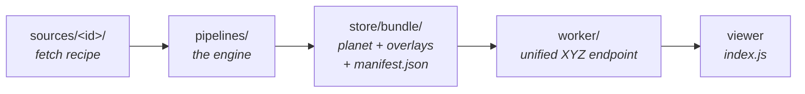

# Contributing

The goal of this project is to create a **planet-scale bathymetry product good enough to use in a nautical chart**, not just a bathymetry visualizer. It is a **derived, supplementary** layer for situational awareness and passage planning, not an official Electronic Navigational Chart and never a replacement for one.

## Principles

A chart is a safety instrument: where this layer can't be authoritative, it must be _conservative_ and _honest about its own quality_. Two rules separate "looks like a chart" from "safe to glance at on the water":

1. **Bias shallow.** Where the data is uncertain or processing must round, err toward _less_ depth — charted depth ≤ true depth. This constrains contour smoothing (a line must not migrate into deeper water) and datum choice (a low-water datum, not MSL).
2. **Carry provenance and confidence to the pixel.** The mariner must be able to tell GEBCO-interpolated deep ocean from a surveyed 3 m coastline — source identity and a quality grade travel with the data into the tiles.

## Getting Started

### Prerequisites

The toolchain is heavy native tooling. There are two routes to get it running:

1. **Docker (recommended)**: Everything runs with Docker as the only local dependency. Run any of the documented commands with `./docker.sh`.

   ```bash
   # build the harbor demo (streams sources from R2)
   ./docker.sh preview

   # serve it — open http://localhost:5173
   ./docker.sh dev
   ```

2. **Local dependencies**: This is faster for iterative development but requires a lot of local setup, could be brittle, and is subject to change. You'll need:
   - **[uv](https://docs.astral.sh/uv/)** — Python env for `pipelines/` (synced automatically on the first `uv run`).
   - **[just](https://github.com/casey/just)** — task runner.
   - **GDAL CLI** — `gdalwarp`, `gdal_translate`, `gdal_contour`, `ogr2ogr`, `gdalbuildvrt`, `ogrinfo`.
   - **tippecanoe** + **tile-join** — contour vector tiles.
   - **Node + npm** — the viewer, style, and Worker are one npm workspace; a single `npm install` at the root covers all three (including `wrangler`).

### Commands

Depending on your setup, run either `./docker.sh <cmd>` or `just <cmd>`:

- `preview` - build a real multi-source harbor mosaic and seed the local Worker R2, range-reading sources straight from R2 — **no dataset download**. The fastest feedback loop: run it whenever you make a visual change. (`preview-local` builds the same demo from already-prepared sources in `pipelines/store/source/`, fully offline.)
- `dev` - run both dev servers (tile Worker on :8787 + viewer on :5173, installing npm deps on first run), then open <http://localhost:5173/#12/40.55/-73.96>
- `source <id>` - prepare one source (fetch → datum → normalize → bounds → polygon → tarball)
- `sources` - prepare every source under `sources/`
- `landmask` - prepare the OSM land mask once (coarse sources clamp land negatives to it)
- `planet` - cover → aggregate → downsample → bundle → contours → soundings (set `BBOX="W,S,E,N"` for a region)
- `test-sources` - offline source-stage self-check (synthetic, no network)
- `test-engine` - offline aggregation/bundle self-check (priority, zoom cap, pyramid)

### Configuration

Key knobs (env vars, read by `pipelines/utils.py` / `bundle.py`):

- `BBOX` - `"W,S,E,N"` bounding box for a regional build (empty = full global)
- `MACROTILE_Z` - base/overlay split (default 8)
- `OVERLAY_SPLIT_Z` - overlay grid cell zoom (default 5 — raise it if a cell's bundle ever outgrows a CI runner)
- `NUM_OVERVIEWS` - overview pyramid levels below each source's native maxzoom
- `SMOOTH_DEM_SIGMA` / `SMOOTH_SLOPE_LOW` / `SMOOTH_SLOPE_HIGH` - slope-adaptive DEM smoothing (Gaussian sigma + the slope band it fades across)
- `SKIP_SMOOTH`, `SKIP_CONTOURS`, `SKIP_SOUNDINGS`, `SKIP_DRYING`, `SKIP_DEPARE` - skip that step
- `CONTOUR_NAV_SMOOTH_MAX` - navigable-band contour-smoothing gate (replaces the retired `SKIP_CONTOUR_SMOOTH`)
- `SOUND_CELL_PX` / `SOUND_MIN_DEPTH_M` - sounding spacing / min charted depth
- `DRYING_CAP` - max elevation (m) tinted as drying foreshore

## Architecture

This repo turns bathymetry DEMs (GEBCO + regional high-res sources) into MapLibre/Mapbox tiles, served through a single Cloudflare Worker endpoint. Per-source build
steps feed a planet build, which produces a base + fixed-grid overlays.



### Layout

- `sources/<id>/` - one dir per source: `metadata.json` (attribution), `file_list.txt` (URLs), `Justfile` (its fetch→DEM recipe). [sources/README.md](sources/README.md) is the catalog + how to add one.
- `pipelines/` - the Python engine (`uv` project) + `Justfile`. Stages: source → aggregation → downsampling → bundle.
- `worker/` - Cloudflare Worker (TypeScript) that serves the unified tile endpoint from R2.
- `index.js`, `index.html` - Vite/MapLibre viewer (repo root).
- `style/` - `@openwaters/seascape` (npm workspace): the MapLibre style as a library — flavor + `sources()`/`layers()`; the Worker serves it assembled at `/style.json`. Tests: `npm test`.
- `data/`, `pipelines/store/`, `dist/` - build artifacts (gitignored). All pipeline stages write under `pipelines/store/`.
- `docs/` - [nautical-chart references](docs/nautical-chart-references.md) (IHO/NOAA standards + sounding-selection literature); design research in [RESEARCH.md](RESEARCH.md). Planned work lives in [GitHub issues](https://github.com/openwatersio/seascape/issues).

### Stages

Four stages — `source → aggregation → downsampling → bundle` — all writing under `pipelines/store/` (gitignored), one subdir per stage (`store/source`, `store/aggregation`, `store/pmtiles`, `store/contour`, `store/bundle`, …).

- **source** (`source_*.py`, per `sources/<id>/`): fetch → datum offset → normalize to a 4326 COG → `bounds.csv` → coverage polygon → tarball. Each source owns its recipe (`sources/<id>/Justfile`) composing the shared steps. Priority derives from `(maxzoom, id)` — GEBCO loses (smallest maxzoom), so regional sources win in overlap.
- **aggregation** (`aggregation_*.py`): `cover` slices the planet into source-aware aggregation tiles (one CSV each); `run` reprojects each source by priority into a merged Float32 DEM (Gaussian seam feather), slope-smooths it (`smooth.py`), encodes Terrarium raster tiles, and forks contours (`contour_run.py`) and soundings (`soundings_run.py`) off the same merged DEM. Sources flagged `land_clamp` (GEBCO/EMODnet — coarse, no land/water concept) get their negative land pixels clamped to 0 against the OSM land mask (`landmask.py`, prep once with `just landmask`) right after warp, so shoreline cells don't paint false water/contours/soundings over land. The same mask feeds a `drying_run.py` fork: it polygonizes the green foreshore (elevation in `[0, DRYING_CAP]` seaward of the land line — chart drying areas) into the `drying` layer. A `depare_run.py` fork buckets the same merged DEM into depth-area partitions (ENC DEPARE: water between charted isobaths, `drval1`/`drval2` depth bounds) — the vector twin of the raster depth shading.
- **downsampling**: 2×2-average overview pyramid below each source's native maxzoom.
- **bundle** (`bundle.py`): concat single-zoom pmtiles into `planet.pmtiles` + one overlay archive per populated grid cell + `manifest.json`; contours, soundings, and drying/depare/coverage layers bundle into `vector.pmtiles` via tippecanoe.

A full build (`planet`) lands in `pipelines/store/bundle/`:

- `planet.pmtiles` — the all-sources-merged base (Terrarium-encoded raster, per-zoom quantized), z0–`macrotile_z` (z8 = GEBCO native, no upsampling).
- `overlay-{z}-{x}-{y}.pmtiles` — one per populated `OVERLAY_SPLIT_Z` grid cell (default z5), z`macrotile_z+1`→cell-max, carrying the GEBCO-filled merged mosaic under that cell.
- `vector.pmtiles` — MVT vector source: `contours` (GEBCO baked to the deepest zoom by tippecanoe) plus the folded-in `soundings`, `drying` (green-foreshore polygons), `depare` (depth-band partitions, z6+), and `coverage` layers.
- `manifest.json` — planet metadata + `overlay.cells` ({cell: max_zoom}) for the Worker.

### Why a planet cap + grid overlays

GEBCO is ~z8 native; regional sources reach ~z14. Baking a full z0–14 pyramid would upsample GEBCO globally (hundreds of GB, no new data). Instead: the planet is capped at `macrotile_z` (complete, all-sources-merged base, ~1–2 GB) with fixed-grid overlay archives above it, each carrying the GEBCO-filled merged mosaic (Terrarium has no transparency, so an overlay must not punch holes). Overlays are grid cells rather than per-source archives on purpose: a cell is a fixed fraction of the globe, so a new source adds _cells_ instead of growing any single archive (a per-source overlay's size tracked its footprint and outgrew CI runner disks).

### Contours

A parallel consumer of each aggregation tile's merged DEM: `gdal_contour` at the non-uniform `CONTOUR_LEVELS` → Chaikin smooth (shapely) → clip to the unbuffered tile bbox → 4326. Seam continuity comes from **buffer the DEM input, restrict the tile output** (deterministic merge → byte-identical overlap → lines meet at the clip). Contour tiles are tile-keyed in `store/contour` so clean tiles persist across runs.

## Adding a source

See [sources/README.md](sources/README.md) — the source catalog (built sources, open candidates, ruled-out) and the step-by-step recipe for adding one.

## Serving (`worker/`)

The Worker presents one endpoint per layer and resolves per tile:

```
GET /seascape/{z}/{x}/{y}.webp   raster: z≤8 → planet · z>8 in a populated grid cell → that cell's overlay · else → overzoom the planet · miss → transparent
GET /seascape/{z}/{x}/{y}.pbf    vector: vector.pmtiles passthrough (contours, soundings, drying, depare, coverage layers)
GET /seascape/raster.json        TileJSON (terrarium raster)
GET /seascape/vector.json        TileJSON (vector layers)
```

This keeps the base at native z8 (no global upsampling) while presenting one
source whose served maxzoom tracks the deepest overlay cell — the Worker
synthesizes the high-zoom GEBCO fallback on demand
and caches it (the overlay cell is computed from the tile address — no footprint
search). Overlays carry GEBCO-fill (Terrarium has no transparency, so a
source's nodata would otherwise punch holes over the base). All pmtiles are read
from R2 over HTTP range.

The MapLibre style is generated by `style/` (`@openwaters/seascape`, protomaps-basemaps
shape: flavor + `sources()`/`layers()`/`depthRelief()`) and served assembled by the
Worker at `/style.json` (`?unit=`/`?safety=` bake mariner defaults). Sources point at
the Worker's TileJSON, so the style needs no manifest. TypeScript: `tsc` emits
`style/dist/` on install; Vite dev reads `index.ts` directly (development export
condition), but wrangler dev and `vite build` read `dist/` — rebuild after style edits.

- Local: `npm run seed -w worker` (populates the local sim R2 from `pipelines/store/bundle/`) then `just dev`.
- Production: `npm run deploy -w worker` (set the R2 bucket + `RELEASE_PREFIX` in `wrangler.toml`).

## CI / build & release

`.github/workflows/ci.yml` (per-commit checks), `build.yml` (full build), and `release.yml` (publish + deploy):

- **Every push** (ci.yml) ensures the deps-only toolchain image exists (built only when `Dockerfile`/`pyproject.toml`/`uv.lock` change — code mounts at runtime) and runs the offline self-checks (`test-sources`, `test-engine`) against it; the viewer builds too.
- **Manual dispatch** (build.yml) runs the full build: prepare each source (matrix) → plan the covering and diff it against the previous run (`get_dirty_aggregation_filenames`) → aggregate only the changed tiles, sharded across runners by strided slice of the dirty list → bundle planet + overlays + contours + manifest. Build state and per-commit bundles persist in the public **data bucket** (`data.openwaters.io`) under `bathymetry/`, so rebuilds are incremental and clean tiles' pmtiles/contours are reused. The build is dispatch-only on purpose — a shared store shouldn't be mutated by routine pushes. Manual runs (Actions → Build → Run workflow) accept an optional `bbox` and shard count.
- **On a published release** the build for that commit (`bathymetry/build/<sha>/` in the data bucket) is promoted into the Worker-fronted **serving bucket** (`tiles.openwaters.io`) at `seascape/<sha>/`, the Worker is deployed pointing at it (`RELEASE_PREFIX=seascape/<sha>/`), and the viewer ships to GitHub Pages. Releasing promotes the build a dispatch already produced — **dispatch a build for a commit before releasing it**. Re-dispatching `release.yml` with a prior built sha republishes it with no rebuild.

Two R2 buckets — `data` (public, all build state) and the serving bucket. Required
repository secrets: `R2_ACCOUNT_ID`, `R2_ACCESS_KEY_ID`, `R2_SECRET_ACCESS_KEY`,
`R2_BUCKET` (the serving bucket), and `CLOUDFLARE_API_TOKEN` (Worker deploy). The R2
credentials need read/write on **both** buckets; the Worker's binding
(`worker/wrangler.toml` `bucket_name`, overwritten at deploy) names the serving bucket.

## Conventions

- `pipelines/*.py` vendored from mapterhorn keep its BSD-3 attribution (`pipelines/LICENSE.mapterhorn`).
- Each non-trivial step ships a runnable self-check (`test_*.py`, `python smooth.py`, `python encode.py`).
- Mark deliberate simplifications with a plain comment naming the ceiling + the upgrade path.
- Don't commit build artifacts (`pipelines/store/`, `data/`, `dist/`, `output/`).
