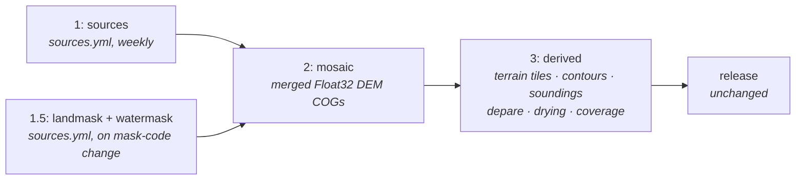

# Production planet build — planning doc

*Written 2026-07-09. Point-in-time; the code is the source of truth. Companion to [2026-07-08-sources-mirror.md](2026-07-08-sources-mirror.md) (stage 1, done on `worktree-sources-mirror`) and [docs/build.md](../build.md) (the current CI build this plan replaces).*

## Problem

The current build is a GitHub Actions matrix fan-out with all incremental state in a shared R2 prefix. It works, but every constraint documented in [build.md](../build.md) is coordination tax paid to ephemeral 4vCPU/16GB runners, not something intrinsic to the problem: the 6h job cap forced contour sharding + a serial `tile-join` merge; 16GB forced `AGG_PROCESSES=2`; the 256-matrix ceiling caps fan-out; shards sharing one mutable store require frozen work lists, a global concurrency lock, no-`--delete` discipline, and twice-guarded prunes (which still once started deleting the planet's vector store on a BBOX run).

The scale doesn't justify any of it. The entire tile store is ~50 GiB — roughly 2.5M tiles, ~6.5×10¹¹ output pixels, tens of core-hours for a full forced rebuild. That is an overnight run on one 48-core machine (Planetiler builds the whole OSM planet on one box in ~2h; this problem is smaller). A weekly volatile-source incremental is minutes.

Two deeper defects are independent of the runner substrate:

- **The covering diff cannot see code or config.** It keys only on source coverage, so a change to smoothing, contour levels, or encode quantization marks nothing dirty — the store keeps serving output built by old code unless someone remembers `force: true`. This is the most common way to ship a stale planet.
- **Everything derived rebuilds monolithically.** The merged DEM exists only transiently inside each aggregate worker, so iterating on anything cartographic (contour levels, smoothing, sounding density) re-runs the expensive source-merge machinery for the whole affected area. There is no cheap "re-derive from the same bathymetry" loop.

## Goals

- **Promote the merged DEM to a durable, published product** (the mosaic), splitting the build into stages with independent change cadences: sources (external, scheduled — done, see sources-mirror), mosaic (only when sources or merge code change), derived products (cheap, frequent — where all cartographic iteration lands).
- **Content-hash incrementality that sees code and config.** A target's cache key includes the code modules and config values that produce it. Changing `CONTOUR_LEVELS` rebuilds contours and nothing else; changing nothing rebuilds nothing. The `force` input survives only as an escape hatch, not a correctness requirement.
- **One build machine** (ephemeral Hetzner box, the seamap `build-planet.yml` pattern), deleting the shard/freeze/matrix machinery outright.
- **Immutable artifacts + atomic manifest publish + out-of-band GC**, deleting the global lock, the prune steps, and their guards.
- Keep unchanged: R2 storage + egress-free serving, PMTiles, the Worker's overlay routing, the release promotion flow, and `pipelines/` R2-agnosticism (`just planet` on a laptop stays identical to production).

## Non-goals

- **A distributed batch pool.** One box holds until regional hi-res coverage grows ~10–50× (multi-TB store, rebuilds no longer fit overnight) or volatile churn saturates the build window. The hash graph is what makes that later migration a substrate swap (each target becomes a container job keyed by its hash), not a rewrite — which is why it's in scope now and the pool isn't.
- **Zarr, Iceberg, workflow engines (Argo/Dagster/Prefect), Dask.** Wrong rungs: GDAL reads COG/VRT natively; the manifest pointer swap gives ACID publish with zero dependencies; the orchestrator is a build graph + process pools + cron.
- **The per-pixel confidence/provenance band** — separate plan ([2026-07-08-confidence-provenance.md](2026-07-08-confidence-provenance.md)). The mosaic layout must leave room for it (a sidecar per-tile raster), and it must be resampled nearest-neighbour and never pass through the seam feather, but building it is not this pass.
- **Changing the serving model.** Stage 3's outputs are byte-compatible with today's `build/<sha>/` contract: `planet.pmtiles`, `overlay-*.pmtiles`, `vector.pmtiles`, `coverage.pmtiles`, `manifest.json`. The Worker and release.yml don't change. (Noted for later: once outputs are content-addressed, release promotion could become a pointer write instead of a bucket-to-bucket copy — worthwhile only if promotion time or cost ever registers.)

## The stages



### Stage 1 — sources (already done, `worktree-sources-mirror`)

Source registration and volatile-source mirroring live in `sources.yml`, outside the build, on a weekly cron + dispatch. Builds never contact NOAA; `bounds.csv` published last is the atomic pointer; a red sources run is the alert channel while last-good bounds keep builds green. This plan takes that as given and depends only on its outputs: `source/<id>/` COGs + `bounds.csv` + recipe hash per source.

**Stage 1.5 — landmask + watermask move into `sources.yml` too.** They are source-shaped inputs (fetched from OSM/Overture, recipe-hash-gated, consumed by the mosaic) on their own upstream cadence, and `build.yml` should not contain any fetch-from-upstream step at all. Same shape as a prepared source: artifacts pushed, hash marker last.

**Stage 1 output: one catalog item per source.** Today a source's identity is scattered across three files plus recipe CLI args: `metadata.json` (attribution + flags, hand-edited), `bounds.csv` (per-file bounds), `.recipe-hash` (staleness marker) — and the vertical-datum offset lives only in a `source_datum --offset N` argument, invisible to everything downstream. Stage 1 consolidates the machine-facing view into a generated `catalog.json` per source, published with `bounds.csv` (same atomicity: after artifacts, before the pointer flips). STAC-Item-*shaped* — `id`, `bbox`, license/attribution, CRS, **vertical datum and the applied offset**, `priority`/`max_zoom`/`land_clamp`/`volatile`, band info, and the recipe/content hash — because the shape costs nothing and keeps interop open, but spec compliance is not a goal and no STAC tooling becomes a dependency. `metadata.json` stays the small hand-edited input; recipes don't change — `source_datum` et al. *record* what they applied into the item at prep time. Downstream, the catalog item is the single thing the mosaic key and manifest read per source (replacing metadata.json reads + the `.recipe-hash` marker), and it's what makes the mosaic manifest's per-tile provenance and the datum invariant checkable rather than aspirational.

### Stage 2 — the mosaic

The product: the **survey-faithful merged bathymetry** — per aggregation tile, a Float32 COG holding the priority-resolved (`(priority, maxzoom, id)` deterministic order), seam-feathered, datum-offset, land-clamped merge of every intersecting source, at the tile's native resolution (max source maxzoom), with nodata-aware `average` internal overviews from native down to ~z8-equivalent only (~6 levels on a z14 tile; an *access* property of the truth layer, unsmoothed by design — see the two-pyramids note below). Below z8, one **planet z8 Float32 COG** (the mosaic decimated to the GEBCO-native base) takes over, registered as the whole mosaic's overview via the GTI XML `<Overview><Dataset>` element; it doubles as the z0–z4 render source. The internal overviews are not a duplicate of the served pyramid (different data: unsmoothed truth vs smoothed render) — they are what makes the tiles actually cloud-optimized: a z9 render over a z14-native tile reads ~1 MB through the 32× overview versus ~1 GB of native Float32 without it, and every consumer between z8 and native (stage-3 windows, QA in QGIS, any future third party) hits the same cliff. Cost: ~+33% on the hi-res tiles ≈ +$0.20/mo of R2.

The single-file mosaic definition is a **GTI raster tile index** (GDAL ≥3.9; the pinned 3.13 toolchain qualifies): a GeoParquet index whose rows are the tile COGs (absolute `/vsicurl` locations), **doubling as the mosaic manifest** — the GTI driver reads the columns it knows (`location`, `resx`/`resy`, …) and ignores the rest, so per-tile content-hash key, source-id list, datum, and priority ride along as `seascape:`-prefixed attribute columns (the stac-geoparquet convention — colons are legal Parquet/OGR field names; SQL queries just quote them). One file is simultaneously the GDAL-openable planet mosaic and the columnar, DuckDB-queryable manifest. (Backing format: GeoParquet or FlatGeobuf — the driver treats both as first-class and at a few thousand rows either is fine; implementer's call.) GTI over a classic VRT because VRT collapses everything onto one fixed pixel grid — `-resolution highest` declares a planet-at-z14 raster with GEBCO regions modeled at ~4 m — while GTI keeps each tile's native resolution; the non-overlapping partition also means no sort/z-order field is needed. QGIS opens GTI directly through its bundled GDAL (any build with GDAL ≥3.9 — every current release qualifies); a throwaway `.vrt` view is an escape hatch for ancient installs only, never source of truth.

Explicitly **not** in the mosaic: slope-adaptive smoothing (`smooth.py`), Terrarium encoding, anything zoom- or display-conditioned. Those are cartographic generalization and belong to stage 3 — the mosaic is the truth layer you can QA, diff between builds, and eventually publish as an open dataset in its own right. (Attribution for a published mosaic composites per-tile source lists from the manifest; the existing per-source `metadata.json` carries the text.)

What this dissolves:

- **The downsampling stage disappears as a store — but there are two pyramids, and they must not be conflated.** The mosaic COGs' internal overviews are the *access* pyramid: unsmoothed truth, `average`-resampled (never `nearest` — decimation is the anti-alias prefilter), existing so coarse windowed reads hit an overview instead of z14 data. A decimated GDAL read picks each COG's overview automatically, so the stage-3 rule is: always read at target resolution, never full-res-then-decimate in Python. The *served* pyramid is stage 3's product, built after smoothing exactly because smoothing is display generalization: each zoom renders by reading the mosaic at that zoom's resolution → depth/zoom-gated smooth at that resolution → encode. That per-zoom render is what replaces `downsampling.py` (per-zoom store, freeze/shard/tail modes, staleness cascade all go). It is also a deliberate behavior change: today smooths once at native res and box-averages down, so a sigma has no defined ground size at coarse zooms; per-zoom smoothing gives `f(depth, zoom)` a real meaning at every level, which the zoom-tier contour design already assumes. Accepted consequence: coarse zooms are no longer a strict decimation of fine zooms, so features may shift slightly between levels — invisible in shading, already intended for contours.
- **Seam reconciliation gets structurally easier.** Stage 3 consumers window one continuous mosaic with a buffer, instead of reproducing byte-identical overlapping merges per tile. The buffer-input/restrict-output discipline survives, but its hard part (deterministic re-merge in the overlap) is no longer re-executed per consumer.
- **Re-tiling stops being dangerous.** A covering change writes new mosaic tiles under new keys and a new manifest; superseded tiles become unreferenced garbage for GC. The orphan prunes and their 25% guards are deleted, not ported.

### Stage 3 — derived products

Everything cartographic, each an independent hash-keyed consumer of mosaic windows:

- **Terrain tiles**: per-zoom render — read the mosaic at zoom-z resolution → smooth (`smooth.py`, depth/zoom-gated) → Terrarium encode (bias-shallow quantization) → `planet.pmtiles` (z0–`MACROTILE_Z`) + per-cell `overlay-*.pmtiles` (GEBCO-filled — Terrarium has no transparency) + `manifest.json`. The z8/overlay split stays a stage-3/serving concern; the mosaic knows nothing about it. The lowest zooms (z0–~z4) render from the planet z8 COG (the mosaic's own GTI-registered overview) rather than fanning out across thousands of tile COGs' top overviews. Coarse-zoom resampling is a conscious choice, not a `-r average` default: `average` moves an isolated shoal deeper (today's downsample already has this property — latent, not a regression); the conservative signal at coarse zoom is carried by soundings/depare, and if the shading itself should bias shallow, use a shallowest-in-window reducer in the navigable band (≤~30 m) and let `average` stand in deep water — the navigational-depth-bands split.
- **Contours** (`contour_run.py`): gdal_contour at `CONTOUR_LEVELS`/`CONTOUR_LEVELS_FT` → Chaikin smooth under the never-deeper constraint → clip.
- **Soundings, depare, drying**: unchanged internal logic (drying rides depare), re-pointed at mosaic windows.
- **Coverage**: footprints → `coverage.pmtiles`, unchanged, runs concurrently with everything (it reads polygons, not the mosaic).
- **Vector bundle**: **one global tippecanoe per layer + one `tile-join`** on the build box. The shard-and-merge path (`bundle-shard`, `contour-maxz.txt`, `bundle_merge`) existed only for the 6h cap and is deleted.

This is where the iterative-development payoff lands: a contour-levels or smoothing change re-runs stage 3 against a fully cached mosaic — no source reads, no merge, no landmask — and only stage 3.

## The hash graph

Every target's cache key is `H(input hashes ‖ code hash ‖ config values)`. Concretely:

| Target | Inputs in the key | Code in the key | Config in the key |
| --- | --- | --- | --- |
| mosaic tile | intersecting sources' catalog items (recipe hash + bounds rows), landmask + watermask hashes | merge/reproject/clamp modules | per-source priority · maxzoom · offset · land_clamp (all read from the catalog item), feather params, covering params |
| terrain tiles | mosaic tile hashes under the output tile | `smooth.py`, `encode.py`, `bundle.py` | `SMOOTH_*`, quantization, `MACROTILE_Z`, `OVERLAY_SPLIT_Z`, `NUM_OVERVIEWS` |
| contour tile | mosaic tile hashes under the (buffered) window | `contour_run.py` | `CONTOUR_LEVELS(_FT)`, `CONTOUR_NAV_SMOOTH_MAX`, zoom-tier levels |
| soundings / depare / drying tile | mosaic tile hashes (+ watermask, drying FGB for depare) | their modules | `SOUND_*`, `DEPARE_LEVELS`, `DRYING_CAP` |
| vector.pmtiles | all contour/sounding/depare FGB hashes | tippecanoe flags + filter code | per-zoom filter, layer flags |

Rules that make it honest:

- **Code hashing is per-module and coarse on purpose**: each stage declares the `pipelines/*.py` files it depends on (a small static list next to the stage, not import-graph introspection), and the key hashes those files. Over-invalidation (a comment edit rebuilds the stage) is acceptable; under-invalidation is the bug this exists to kill. The toolchain image tag (GDAL/tippecanoe versions) is in every key.
- **Config enters the key as resolved values**, not env-var names — the stage serializes the knobs it actually read.
- **Substrate: a small `keys.py` helper, not a framework.** Each stage already has a notion of done markers and dirty lists; the helper replaces them: `key = stage_key(...)`, skip if `store/<stage>/<stem>-<key12>` exists (locally or in the hydrated store). Start there; adopt Snakemake/DVC only if the helper's DAG bookkeeping grows past a couple hundred lines. The covering-diff machinery (`get_dirty_aggregation_filenames`, freeze-work) is deleted once keys cover it — spatial change detection falls out naturally, since only tiles whose intersecting source hashes changed get new keys.
- **Cadence is emergent, not scheduled.** One graph run on any trigger: a weekly S-102 drift dirties only US-coastal mosaic keys → only their derived tiles re-run; a contour-config push leaves stages 1–2 at 100% cache hit. No "did the mosaic rebuild first" ordering exists to get wrong.

## Store layout and the publish protocol

The R2 data bucket (`bathymetry/`) becomes: inputs, two content-addressed stores, per-build outputs, and pointers.

```
bathymetry/
  source/<id>/…              stage 1 (bounds.csv is its pointer; + generated catalog.json)
  landmask/                  stage 1.5 (unchanged shape)
  mosaic/
    tiles/<stem>-<key12>.tif       immutable content-addressed COGs (+ sidecars later)
    index/<buildid>.parquet        GTI GeoParquet index = the manifest (tile → key + provenance + datum)
    mosaic.gti                     the pointer — small XML naming the current index; one atomic PUT,
                                   written last; GDAL opens the planet mosaic straight from this file
  derived/
    <layer>/<stem>-<key12>.*       immutable FGB / pmtiles intermediates
  build/<sha>/                     final bundles + manifest.json (unchanged contract)
```

- **Hydrate**: on box boot, `rclone copy` the two stores down to local NVMe (~50 GiB, minutes; R2 egress and Hetzner ingress are both free). R2 stays the source of truth; the box is disposable.
- **Build**: entirely against local disk. No mid-build R2 writes — a failed build leaves R2 untouched.
- **Push**: `rclone copy` (never `sync --delete`) new keys up — content-addressed, so unchanged keys are skipped and an incremental push is delta-sized — then manifests, then `build/<sha>/`, then pointers **last**. A crash mid-push leaves the old pointers over a complete old world; half-pushed objects are unreferenced garbage.
- **GC**: a separate scheduled workflow deletes keys unreferenced by the last N mosaic/build manifests and any manifest a live release points at. It never runs during a build (shared concurrency group). This is the only deletion path anywhere.
- **Single writer**: the `concurrency: r2-store` group already shared with `sources.yml` — now trivially sufficient, since exactly one box writes and every write is to a fresh key.

**Regional builds (BBOX).** Everything above is exercisable locally with a bbox, and build.md's three BBOX hazard classes collapse to one rule. A regional run builds the window's mosaic COGs + a local GTI (QGIS-inspectable), and stage 3 can iterate against the *published* mosaic via `/vsicurl` with no local stage 2 at all; hash keys are identical on a laptop and the build box, so cache behavior is itself locally testable. Content-addressed artifacts from a regional run cannot corrupt the planet store — worst case they add unreferenced keys for GC — so the store-reconciling and rebuild-scoping distinctions disappear. What survives: **a BBOX run never writes planet-scoped pointers** (`mosaic.gti`, build manifests), and stage 1 metadata stays always-global (a window-scoped `bounds.csv` claiming planet validity remains forbidden). The planet z8 COG and planet-wide GTI are inherently global — regional runs stream the published ones or accept window-scoped stand-ins (the `coverage.pmtiles` precedent).

## Compute

The seamap `build-planet.yml` pattern, adapted: boot an ephemeral Hetzner box (ccx63-class, 48 vCPU / 192 GB — request the dedicated-vCPU quota raise first) + attached volume, `docker pull` the existing GHCR toolchain image, rsync the repo, hydrate, `just planet`, push, always-destroy. Expected costs, for calibration: ~€2/hr while building → roughly €10 per forced planet build, €1–3 per weekly incremental; R2 grows by the mosaic store (Float32 COGs ≈ the current tile store again, ~+$1–2/mo) on top of today's ~$4/mo. Total well under €20/mo at weekly cadence, ~$0 when idle. `build.yml` shrinks to roughly: image job + boot/run/destroy + the concurrency group. The self-hosted-runner marketplace action is an acceptable variant (Actions-native logs, no SSH heredoc, no 6h cap applies); the SSH pattern is fewer moving parts — implementer's call. A dedicated box shared with seamap is a later option; hydrate-from-R2 stays the design either way so the box remains cattle.

Parallelism on the box (mostly knobs and deletions — the pools already exist):

- **aggregate/mosaic**: `Pool` already defaults to all cores with `AGG_PROCESSES` unset; cap by RAM instead (`min(cores, RAM // ~4 GB per worker)` ≈ 40 on 192 GB) and raise `GDAL_CACHEMAX`. More workers also hide `/vsicurl` range-read latency, the real throughput limit.
- **stage-3 renders**: per-tile, embarrassingly parallel, same pool pattern.
- **bundle**: overlay-cell groups are independent — wrap the group loop in a `Pool` (small change; today it's serialized per matrix job).
- **vector bundle**: one global tippecanoe per layer (internally threaded) + one join, replacing shards.
- **DAG overlap**: coverage tippecanoe, source-bounds refresh, and mosaic work are independent — run them concurrently (`just` recipes backgrounded, or the keys helper's runner; keep it dumb).
- **Deleted**: `shard <i> <n>` modes everywhere, `freeze-work`, `shard-matrix`/`downsample-matrix`/`bundle-matrix`, `downsample-shard-keys`, `bundle-group-keys`, `bundle-merge` fragment stitching, `contour-maxz.txt`, the strided-slice R2 pulls, `free-disk-space` gymnastics.

## Dev loop

Once the mosaic is published, `just preview` grows a fast path: hydrate `bounds.csv`-style per-tile mosaic refs and `/vsicurl` **the mosaic** for the bbox, running only stage 3 locally — no source merge, no landmask, no priority logic. Contour/smoothing/style iteration against real planet bathymetry becomes a minutes-long laptop loop. The full-path preview (from sources) remains for stage-2 work. `preview-local` is unchanged.

## Invariants (the redesign passes or fails on these)

- **Bias shallow**, verbatim in both places: the conservative Terrarium quantization in `encode.py`, and the contour-smoothing never-migrate-deeper constraint.
- **Deterministic merge order** `(priority, maxzoom, id)` — and priority/maxzoom live *in the mosaic key*, so a precedence change re-merges.
- **Buffer the input, restrict the output** for every windowed stage-3 consumer reading the mosaic.
- **Datum is an explicit recorded offset**, carried in the source catalog item and the mosaic manifest — never implicit in a recipe arg alone.
- **Nearest-neighbour for categorical rasters** (the future provenance/confidence sidecar); never through the Gaussian feather.
- **`land_clamp` immediately after warp** for flagged coarse sources; watermask subtraction preserved.
- **nodata discipline**: overviews built nodata-aware (average over the valid subset; one numeric sentinel across every tile COG, not NaN); no nodata leaking into contours; the served render resolves nodata to GEBCO fill before encode even where the truth mosaic legitimately carries it.
- **One smoothing function.** Terrain shading and contours call the same `f(depth, zoom)` smoothing, so isobaths agree with the shading at every zoom — the per-zoom render model yields that coherence only if both read the same code.
- **Exact grid registration**: pixel-is-area vs pixel-is-point and half-pixel alignment must stay exact across the mosaic split — mosaic tile grids, stage-3 windows, and the serving tile grid all derive from one tiling math, or overlay seams misalign by half a pixel.
- **One pinned GDAL** via the toolchain image — the image tag is in every hash key, so a GDAL bump correctly invalidates the world (dispatch it deliberately).
- **Artifacts before manifests before pointers; no `--delete` anywhere but GC; missing upstream data fails loudly** (sources-mirror rule — no tolerate-and-skip paths in any stage).

## Migration order (each phase shippable alone)

1. **Land `worktree-sources-mirror`** (stage 1). Follow-up passes: landmask/watermask prep into `sources.yml` (stage 1.5), and the generated per-source `catalog.json` (recipes record datum offset + flags at prep time; downstream keeps reading `metadata.json` until phase 3 re-points the keys at it).
2. **One box.** Rewrite `build.yml` on the seamap pattern: boot → hydrate → existing `just planet` (current pipeline semantics, covering-diff and all) → push → destroy. Delete the matrix/shard/freeze recipes and jobs. This alone removes the RAM/disk/6h/matrix constraints and most of build.yml, without touching pipeline logic. Un-cap `AGG_PROCESSES` by RAM; single tippecanoe; parallel bundle groups.
3. **Hash keys.** Add `keys.py`; re-key each stage's done-check on content hashes (inputs ‖ code ‖ config); delete the covering diff, `.done` markers, and the `force`-for-correctness requirement (keep `force` as an escape hatch). The prunes become dead code but stay until phase 4.
4. **Immutable store + GC.** Move `pmtiles/`/`contour/`/etc. writes to content-addressed keys + build manifests + pointer-last publish; delete both prune steps and their guards; add the scheduled GC workflow.
5. **Mosaic split.** Persist the merged DEM as the stage-2 product (COG + overviews + manifest); re-point smooth/encode/contours/soundings/depare/drying at mosaic windows; delete the per-zoom downsample store. This is the largest pipeline change and lands last, on infrastructure phases 2–4 already carry.
6. **Preview-from-mosaic** fast path in the Justfile.

## Alternatives considered

- **Stay on GH Actions with larger runners**: ~$15/h for 64 cores — dedicated-box prices while keeping all the ephemeral-runner coordination machinery. Worst of both.
- **Workflow engine (Dagster/Argo/Prefect) or Dask/Coiled**: a control plane for distribution problems one box doesn't have; the orchestrator here is a build graph + pools + cron.
- **Zarr datacube**: earns its keep for N-dim analytics under Dask; a 2-D DEM that GDAL already streams as COG/VRT gains nothing.
- **VRT as the mosaic definition**: parse cost at a few thousand sources is fine; the disqualifier is the single fixed pixel grid (planet-at-z14 dimensions or blurred S-102). **STACIT**: right only for consuming an external STAC API; the STAC-shaped source catalog *generates* the GTI — they compose, they don't compete.
- **No per-COG internal overviews (planet z8 COG as the only overview)**: viable for the build itself if stage 3 keeps a per-tile in-memory cascade (one native read → decimate → smooth per level), but it leaves a z9–z13 dead zone where any random windowed read over a hi-res region pulls native Float32 (~1 GB for one z9 tile), un-cloud-optimizes the published COGs for QA and third parties, and saves ~$0.20/mo. Rejected; overviews stay, scoped native→z8-equivalent with the z8 planet COG below.
- **On-read smoothing via VRT pixel functions over the GTI** (a `smoothed.vrt` with a Python pixel function; GTI itself has no processing hooks): rejected for the product path — pixel functions get no halo, so a neighborhood kernel artifacts at every read boundary; the smoothing is `f(depth, zoom)` and a VRT can't know the zoom; and on-read compute leaves no hashable artifact to cache or diff, with every consumer paying the convolution on every read. Fine for cheap per-pixel QA views (unit conversion, expression bands) — never for smoothing.
- **Iceberg-style table format**: the manifest-pointer-swap gives the same atomic-publish semantics with zero dependencies; Iceberg-for-rasters is immature. Revisit GeoParquet/DuckDB on the vector side only if feature-level QA/time-travel becomes wanted.
- **DVC/Snakemake as the hash substrate**: legitimate middle rungs; start with the ~100-line helper because the stages already have marker plumbing to replace, and adopt one only if the helper grows real DAG logic.
- **Smoothing inside the mosaic**: rejected — it's display generalization, config-heavy, and would spoil the mosaic as a QA-able/publishable truth layer; keeping it in stage 3 is what makes cartographic iteration cheap.
- **Dedicated always-on box**: viable (≈€120/mo, kills hydrate), but ephemeral keeps idle cost ~$0 and forces the store to stay disposable; revisit if shared with seamap.

## Validation

- Existing self-checks pass throughout (`test-sources`, `test-engine`, module `--check`s); `keys.py --check` covers: key stable across a no-op rerun, changes on config value change, changes on dependent-module edit, ignores an unrelated module.
- Catalog items: for every source, `catalog.json` exists, its recorded datum offset matches what `source_datum` applied (assert in the source-stage self-check), and every field the mosaic key reads is present — a source with a missing/stale item fails registration, not aggregation.
- Phase 2 acceptance: a BBOX build on the box produces `build/<sha>/` outputs the current CI build accepts (decoded-tile comparison over the bbox, not byte equality — tippecanoe ordering may differ), within the volume budget; record wall-clock + cost.
- Phase 3 acceptance: rerun with no changes → zero work; change `CONTOUR_LEVELS` → only contour/vector targets rebuild (the current footgun, now a test).
- Phase 4 acceptance: kill a push mid-flight → old pointers still serve a complete build; GC dry-run lists only superseded keys.
- Phase 5 acceptance: `gdalinfo`/`gdalcompare` spot-checks of mosaic COGs against per-source truth at sample points (priority, offset, clamp all visible); seam check along mosaic tile edges (contour continuity across a clip line); full-planet build ends in a served preview identical-at-a-glance to the current release over reference harbors (NY, Boston, Jacksonville).
- Throughout: `just preview` and `just planet` on a laptop keep working with no R2 credentials — R2-agnosticism is a regression test, not a convention.
